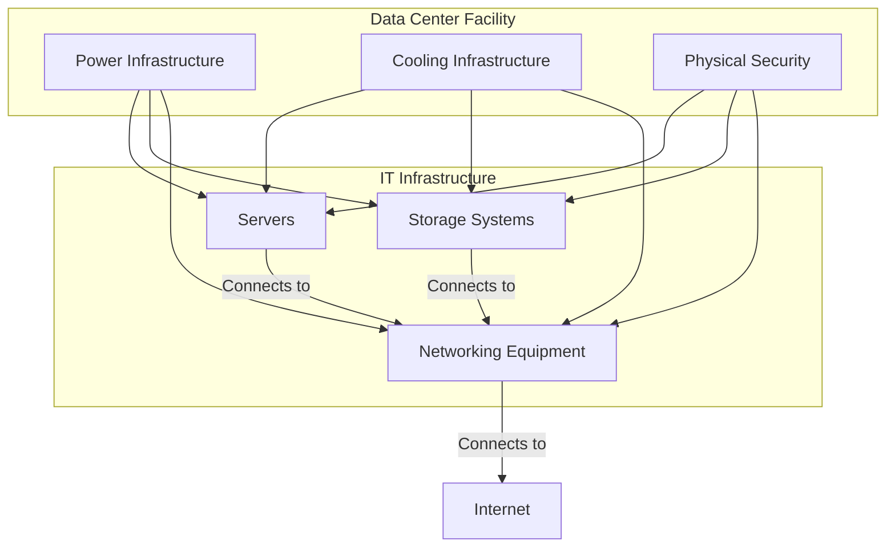

# Data Center: Definition and Key Requirements

## What is a Data Center?

A data center is a dedicated facility that an organization uses to house its most critical applications and data. It is a centralized location that contains the computing and networking equipment necessary to collect, store, process, and distribute large amounts of data.

A data center's design is based on a network of computing and storage resources that enable the delivery of shared applications and data. The key components of a data center design include routers, switches, firewalls, storage systems, servers, and application-delivery controllers.

## Key Requirements for Data Center Elements

Modern data centers are complex facilities with a wide range of components. The key requirements for these elements can be broken down into the following categories:

### 1. Core Components

*   **Servers:** These are the engines of the data center, providing the processing power and memory to run applications.
*   **Storage Systems:** These systems store the vast amounts of data that the data center handles. This can include hard disk drives (HDDs), solid-state drives (SSDs), and tape drives.
*   **Networking Equipment:** This includes routers, switches, and firewalls that connect the servers and storage systems to each other and to the outside world.

### 2. Facility Infrastructure

*   **Power:** Data centers require a significant amount of power to operate. They must have a reliable and redundant power supply, including uninterruptible power supplies (UPS) and backup generators, to ensure that the equipment continues to run in the event of a power outage.
*   **Cooling:** The electronic equipment in a data center generates a great deal of heat. A robust cooling system is essential to prevent the equipment from overheating and failing.
*   **Physical Security:** Data centers house an organization's most valuable asset: its data. Therefore, physical security is paramount. This includes measures such as:
    *   24/7 surveillance
    *   Biometric access control
    *   Security guards
    *   Fire suppression systems

### 3. Operational Requirements

*   **Scalability:** Data centers must be able to scale up or down to meet the changing needs of the business.
*   **High Availability:** Data centers are designed to be highly available, with redundant components and failover mechanisms to ensure that applications and data are always accessible.
*   **Monitoring and Management:** Data centers must be continuously monitored to ensure that all components are operating correctly. This includes monitoring for performance, security, and environmental issues.

### Diagram: Key Data Center Components

