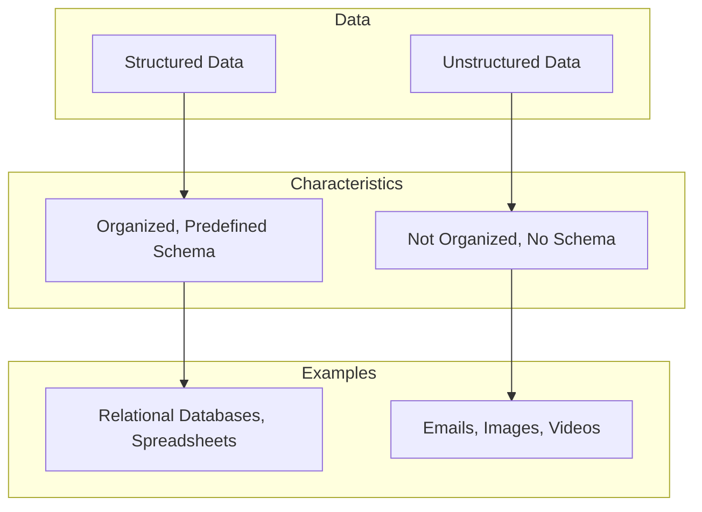

# Differentiating Between Structured and Unstructured Data

Data can be broadly categorized into two types: structured and unstructured. The main difference between the two lies in their organization and how they are stored.

## Structured Data

Structured data is data that has a predefined data model and is organized in a specific format. It is typically stored in a tabular format, such as in a relational database or an Excel spreadsheet.

**Characteristics of Structured Data:**

*   **Predefined Schema:** Structured data conforms to a strict schema, which defines the data types and formats.
*   **Easy to Search and Analyze:** Because of its organized nature, structured data is easy to search and analyze using tools like SQL (Structured Query Language).
*   **Quantitative:** It is often quantitative in nature, such as financial data, sales figures, and customer records.
*   **Examples:**
    *   A customer database with columns for name, address, and phone number.
    *   An inventory database with columns for product ID, name, and quantity.
    *   A spreadsheet with rows and columns of data.

## Unstructured Data

Unstructured data is data that does not have a predefined data model or is not organized in a pre-defined manner. It is often textual or non-textual and does not fit neatly into a relational database.

**Characteristics of Unstructured Data:**

*   **No Predefined Schema:** Unstructured data does not have a rigid schema, which makes it difficult to store and manage in traditional databases.
*   **Difficult to Search and Analyze:** Searching and analyzing unstructured data is more complex and often requires specialized tools and techniques, such as natural language processing (NLP) and machine learning.
*   **Qualitative:** It is often qualitative in nature, such as text documents, emails, images, videos, and social media posts.
*   **Examples:**
    *   Emails
    *   Word processing documents
    *   Images and videos
    *   Social media posts
    *   Log files

## Key Differences: Structured vs. Unstructured Data

| Feature | Structured Data | Unstructured Data |
|---|---|---|
| **Organization** | Highly organized | Not organized |
| **Data Model** | Predefined schema | No predefined schema |
| **Storage** | Relational databases (e.g., MySQL, PostgreSQL) | NoSQL databases (e.g., MongoDB, Cassandra), data lakes |
| **Ease of Search** | Easy to search | Difficult to search |
| **Analysis** | Easy to analyze with traditional tools (e.g., SQL) | Requires advanced analytics tools (e.g., NLP, machine learning) |
| **Examples** | Customer records, financial data, inventory data | Emails, documents, images, videos, social media posts |

## Diagram: Structured vs. Unstructured Data

