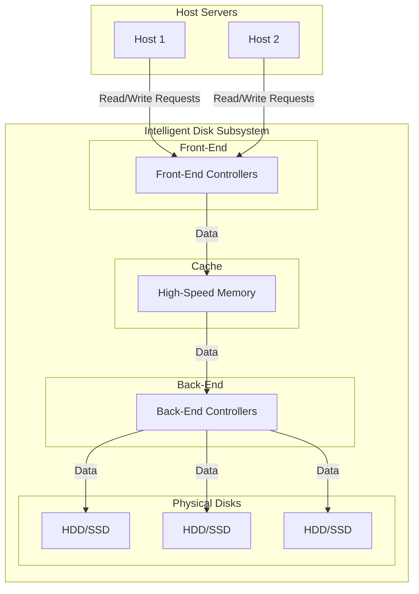

# Intelligent Disk Subsystem

## What is an Intelligent Disk Subsystem?

An intelligent disk subsystem is a storage system that includes a controller with sophisticated firmware to manage the storage and retrieval of data. These subsystems are "intelligent" because they can perform complex functions, such as RAID, caching, and snapshots, without requiring the host computer to manage these tasks.

## Key Components of an Intelligent Disk Subsystem

An intelligent disk subsystem is composed of several key components that work together to provide high performance and reliability:

1.  **Front-End Controllers:** These controllers are responsible for communicating with the host computers. They receive read and write requests from the hosts and send them to the cache.

2.  **Cache:** The cache is a large, high-speed memory that is used to temporarily store data that is being read from or written to the disks. Caching is a key factor in improving the performance of the subsystem.

3.  **Back-End Controllers:** These controllers are responsible for communicating with the physical disk drives. They manage the transfer of data between the cache and the disks.

4.  **Physical Disk Drives:** These are the hard disk drives (HDDs) or solid-state drives (SSDs) that store the data.

## How Caching Enhances Performance

Caching is a critical feature of intelligent disk subsystems that significantly improves performance. Here's how it works:

### Read Caching

1.  When a host requests to read data, the front-end controller checks if the data is already in the cache (a "read hit").
2.  If the data is in the cache, it is sent directly to the host, which is much faster than reading it from the disk.
3.  If the data is not in the cache (a "read miss"), the back-end controller reads the data from the disk and sends it to the cache. The data is then sent from the cache to the host.
4.  The subsystem may also use a "pre-fetch" algorithm to read additional data from the disk that it anticipates the host will request next.

### Write Caching

There are two main types of write caching:

1.  **Write-Through Caching:**
    *   When a host sends a write request, the data is written to both the cache and the disk simultaneously.
    *   The host receives a confirmation that the write is complete only after the data has been written to the disk.
    *   This method is safer, but it does not provide a significant performance improvement for write operations.

2.  **Write-Back Caching:**
    *   When a host sends a write request, the data is written only to the cache.
    *   The host immediately receives a confirmation that the write is complete.
    *   The back-end controller then writes the data from the cache to the disk at a later time.
    *   This method significantly improves write performance, but it is riskier because if the cache fails before the data is written to the disk, the data will be lost. To mitigate this risk, intelligent disk subsystems often use redundant, mirrored caches with battery backup.

## Diagram: Intelligent Disk Subsystem Architecture

