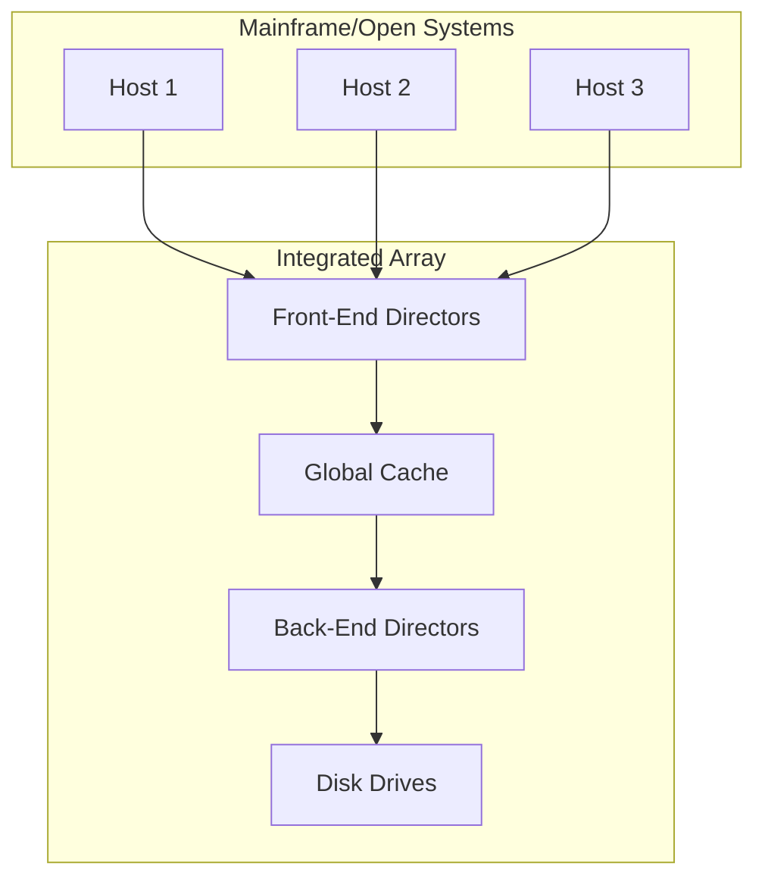
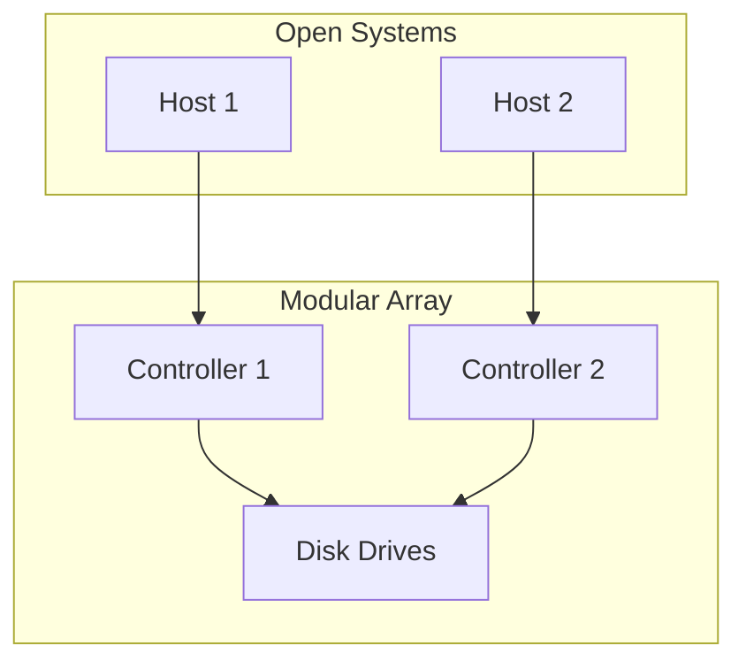

# Integrated vs. Modular Storage Arrays

Storage arrays can be broadly classified into two categories: integrated (or monolithic) arrays and modular arrays. The choice between the two depends on the specific needs of the organization in terms of performance, scalability, and cost.

## Integrated Arrays (Monolithic Arrays)

Integrated arrays are large, high-end storage systems designed for enterprise environments that require high performance and high availability.

**Characteristics:**

*   **Large Capacity:** They are designed to store massive amounts of data, often petabytes.
*   **High Performance:** They have a large amount of cache and a high number of front-end and back-end ports, which allows them to handle a large number of I/O requests simultaneously.
*   **High Availability:** They are designed with redundant components, such as controllers, power supplies, and cooling fans, to ensure that there is no single point of failure.
*   **Mainframe Support:** They are the only type of storage array that can connect to mainframe computers.
*   **High Cost:** They are very expensive to purchase and maintain.

## Modular Arrays

Modular arrays are smaller, mid-range storage systems that are designed for small and medium-sized businesses or for specific departments within a large enterprise.

**Characteristics:**

*   **Scalability:** They are designed to be scalable, allowing organizations to start with a small amount of storage and add more as their needs grow.
*   **Lower Cost:** They are less expensive than integrated arrays.
*   **Limited Performance:** They have less cache and fewer ports than integrated arrays, which limits their performance.
*   **Limited Availability:** They have fewer redundant components than integrated arrays, which makes them less available.
*   **No Mainframe Support:** They cannot connect to mainframe computers.

## Comparison: Integrated vs. Modular Arrays

| Feature | Integrated Arrays | Modular Arrays |
|---|---|---|
| **Target Environment** | Large enterprises | Small and medium-sized businesses, departments |
| **Scalability** | Limited | High |
| **Performance** | Very high | Medium to high |
| **Availability** | Very high | Medium to high |
| **Mainframe Support**| Yes | No |
| **Cost** | Very high | Medium |
| **Management** | Complex | Relatively simple |

## Diagram: Integrated vs. Modular Array Architecture

### Integrated Array

### Modular Array

