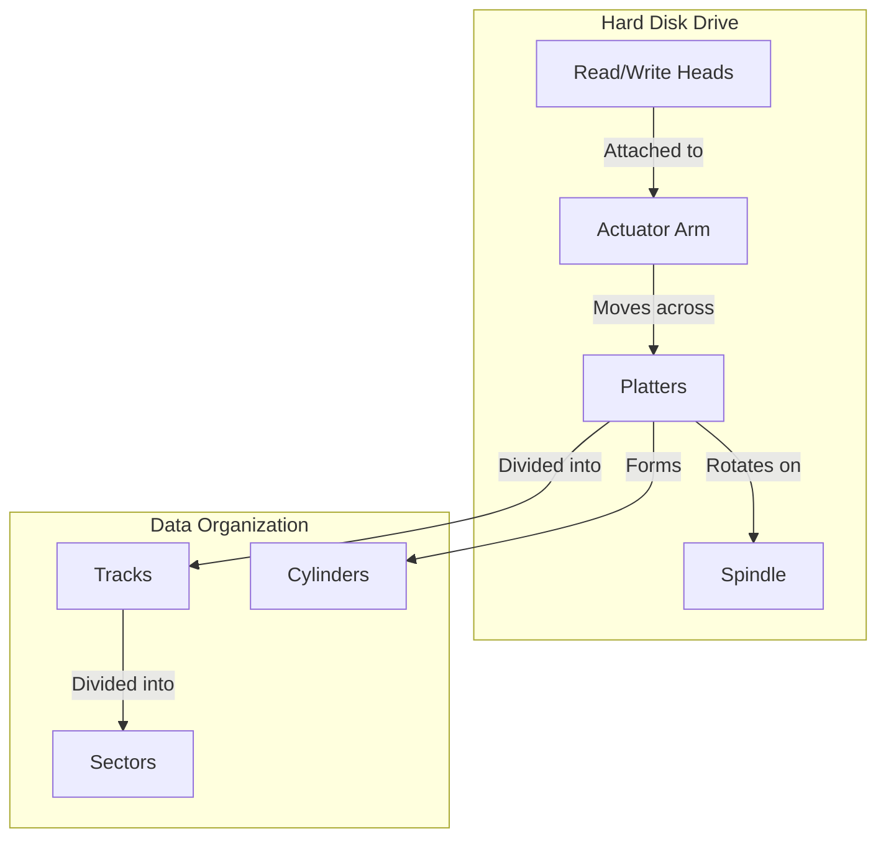

# The Physical Structure of a Disk

A hard disk drive (HDD) is a non-volatile storage device that stores digital data on rapidly rotating platters with magnetic surfaces. Understanding the physical structure of a disk is essential to understanding how data is stored and retrieved.

## Key Components

A hard disk drive is composed of the following key components:

*   **Platters:** These are the circular disks where the data is actually stored. They are made of a rigid material, such as aluminum or glass, and are coated with a magnetic material. A hard drive typically has multiple platters stacked on top of each other.

*   **Spindle:** This is the motor that spins the platters at a high speed, typically between 5,400 and 15,000 revolutions per minute (RPM). The high speed of the platters is what allows for fast data access.

*   **Read/Write Heads:** For each side of each platter, there is a read/write head that reads and writes data to the magnetic surface. The heads are attached to an actuator arm, which moves them across the surface of the platters.

*   **Actuator Arm:** This arm holds the read/write heads and moves them across the platters to the correct location.

*   **Logic Board:** This is the circuit board that controls the operation of the hard drive. It receives commands from the computer and translates them into signals that control the movement of the actuator arm and the read/write heads.

## Data Organization

Data is organized on the platters in a specific way:

*   **Tracks:** Each platter is divided into thousands of concentric circles called tracks. The tracks are numbered, starting from 0 at the outer edge of the platter.

*   **Sectors:** Each track is further divided into smaller units called sectors. A sector is the smallest unit of storage on a disk and typically holds 512 bytes of data.

*   **Cylinders:** A cylinder is a set of all the tracks that are in the same position on all the platters. For example, cylinder 0 is the set of all the outermost tracks on all the platters.

## Diagram: Physical Structure of a Disk

Here is a more detailed diagram illustrating the relationship between platters, tracks, and sectors:

