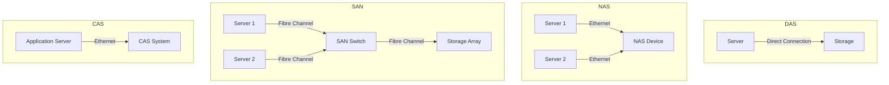

# DAS vs. NAS vs. SAN vs. CAS

This document provides a detailed comparison of four common storage technologies: Direct-Attached Storage (DAS), Network-Attached Storage (NAS), Storage Area Network (SAN), and Content-Addressed Storage (CAS).

## Direct-Attached Storage (DAS)

DAS is a type of storage that is directly attached to a computer or server. It is the simplest and most common type of storage.

*   **Architecture:** The storage device is connected directly to the host computer via a dedicated cable (e.g., SATA, SAS, or SCSI).
*   **Connectivity:** One-to-one connectivity between the storage device and the host.
*   **Management:** Managed by the host computer's operating system.
*   **Security:** Security is managed by the host computer's operating system.
*   **Use Cases:** Suitable for individual workstations, small businesses, and applications that require high performance and low latency.

## Network-Attached Storage (NAS)

NAS is a storage device that is connected to a network and provides file-level data access to multiple clients.

*   **Architecture:** A dedicated file server with its own operating system and storage.
*   **Connectivity:** Connects to the network via Ethernet.
*   **Management:** Managed through a web-based interface.
*   **Security:** Provides its own security and access control features.
*   **Use Cases:** Ideal for file sharing, centralized storage, and backups in small to medium-sized businesses.

## Storage Area Network (SAN)

A SAN is a high-speed network of storage devices that provides block-level data access to multiple servers.

*   **Architecture:** A dedicated network of storage devices, switches, and servers.
*   **Connectivity:** Typically uses Fibre Channel or iSCSI for high-speed connectivity.
*   **Management:** Requires specialized management software.
*   **Security:** Provides advanced security features, such as zoning and LUN masking.
*   **Use Cases:** Suitable for enterprise applications that require high performance, high availability, and scalability, such as databases and virtualization.

## Content-Addressed Storage (CAS)

CAS is a type of storage that stores and retrieves data based on its content, rather than its location.

*   **Architecture:** An object-based storage system that uses a unique hash to identify each object.
*   **Connectivity:** Connects to the network via Ethernet.
*   **Management:** Managed through a specialized API.
*   **Security:** Provides data integrity and authenticity by verifying the hash of each object.
*   **Use Cases:** Ideal for archiving and long-term data retention, such as medical records, legal documents, and compliance data.

## Comparison Table

| Feature | DAS | NAS | SAN | CAS |
|---|---|---|---|---|
| **Access Level** | Block | File | Block | Object |
| **Connectivity** | Direct (SATA, SAS, SCSI) | Ethernet | Fibre Channel, iSCSI | Ethernet |
| **Performance** | High | Medium | Very High | Medium |
| **Scalability** | Low | Medium | High | High |
| **Cost** | Low | Medium | High | Medium |
| **Management** | Simple | Moderate | Complex | Moderate |
| **Use Cases** | Workstations, small servers | File sharing, backups | Enterprise applications, databases | Archiving, compliance |

## Diagram: Storage Architectures

