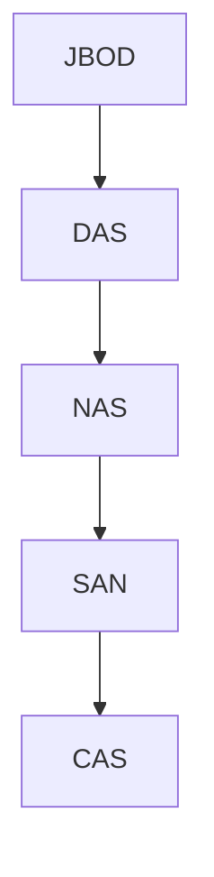

# The Evolution of Networked Storage Architectures

The evolution of storage architectures has been driven by the need for greater efficiency, scalability, and accessibility of data. This evolution can be traced from simple, direct-attached storage to complex, networked storage solutions.

## 1. JBOD (Just a Bunch of Disks)

JBOD is the simplest form of storage, where a collection of hard drives are enclosed in a single chassis.

*   **Architecture:** The drives in a JBOD enclosure are treated as separate, individual drives by the operating system. There is no RAID or other data protection mechanism.
*   **Use Case:** JBOD is often used as a cost-effective way to add a large amount of storage to a server.

## 2. DAS (Direct-Attached Storage)

DAS is a type of storage that is directly attached to a single computer or server.

*   **Architecture:** The storage device is connected directly to the host computer via a dedicated cable (e.g., SATA, SAS, or SCSI).
*   **Evolution from JBOD:** DAS can be seen as a more formal and integrated version of JBOD, where the storage is specifically designed to be directly attached to a server.
*   **Limitations:** The main limitation of DAS is that the storage is only accessible to the computer to which it is attached. This makes it difficult to share data with other users and applications.

## 3. NAS (Network-Attached Storage)

NAS was developed to overcome the limitations of DAS by providing a way to share storage over a network.

*   **Architecture:** A NAS device is a dedicated file server with its own operating system and storage. It connects to the network via Ethernet and provides file-level data access to multiple clients.
*   **Evolution from DAS:** NAS represents a significant step forward from DAS by decoupling the storage from a single server and making it accessible to multiple users and applications on the network.
*   **Use Cases:** Ideal for file sharing, centralized storage, and backups in small to medium-sized businesses.

## 4. SAN (Storage Area Network)

As the amount of data grew and the performance requirements of applications increased, NAS began to show its limitations. SANs were developed to provide a higher-performance, more scalable solution for networked storage.

*   **Architecture:** A SAN is a high-speed, dedicated network of storage devices that provides block-level data access to multiple servers.
*   **Evolution from NAS:** SANs provide a higher level of performance and scalability than NAS by using a dedicated network (typically Fibre Channel) and providing block-level access to data.
*   **Use Cases:** Suitable for enterprise applications that require high performance, high availability, and scalability, such as databases and virtualization.

## 5. CAS (Content-Addressed Storage)

CAS is a more recent development in storage technology that is designed for long-term data retention and archiving.

*   **Architecture:** CAS is an object-based storage system that stores and retrieves data based on its content, rather than its location.
*   **Evolution from other architectures:** CAS represents a shift in how data is stored and managed. Instead of focusing on the physical location of data, CAS focuses on the content of the data itself.
*   **Use Cases:** Ideal for archiving and long-term data retention, such as medical records, legal documents, and compliance data.

## Diagram: Evolution of Storage Architectures

