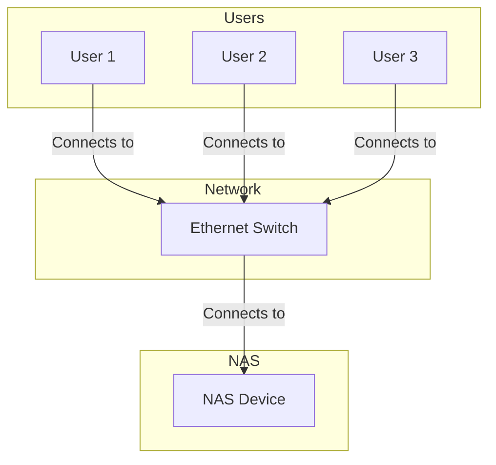

# Benefits of Using NAS for File Sharing in a Collaborative Environment

Network-Attached Storage (NAS) is a dedicated storage device that provides centralized data access to multiple users and devices over a network. In a collaborative environment, using a NAS for file sharing offers numerous benefits:

## 1. Centralized Data Storage

A NAS provides a single, centralized location for all of an organization's files. This makes it easy for users to find and share files, and it eliminates the problem of having multiple versions of the same file scattered across different computers.

## 2. Easy File Sharing and Collaboration

NAS devices are designed for easy file sharing. Users can access files on the NAS from any computer on the network, and they can easily share files with other users by sending them a link. Many NAS devices also include collaboration features, such as file versioning and commenting.

## 3. Improved Data Protection

Most NAS devices support RAID (Redundant Array of Independent Disks), which protects data from drive failures. Many NAS devices also include backup and disaster recovery features, which can help you to recover your data in the event of a disaster.

## 4. Enhanced Security

NAS devices provide a variety of security features to protect your data, including:

*   **User authentication:** Users must log in with a username and password to access the NAS.
*   **Access control:** You can control which users have access to which files and folders.
*   **Encryption:** Many NAS devices support data encryption, which protects your data from unauthorized access.

## 5. Scalability

NAS devices are scalable, which means that you can easily add more storage capacity as your needs grow. This makes NAS a good choice for businesses that are expecting to grow in the future.

## 6. Cost-Effectiveness

NAS is a cost-effective solution for file sharing and storage. It is less expensive than a traditional file server, and it is easy to set up and manage.

## Diagram: NAS in a Collaborative Environment

