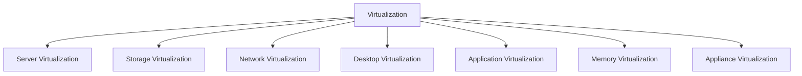

# Virtualization and Its Types

## What is Virtualization?

Virtualization is the process of creating a virtual (rather than actual) version of something, such as a server, a desktop, a storage device, an operating system, or a network. It allows you to run multiple virtual instances on a single physical machine, with each instance being isolated from the others.

## Types of Virtualization

There are several types of virtualization, each with its own specific use case:

### 1. Server Virtualization

Server virtualization is the most common type of virtualization. It involves partitioning a physical server into multiple virtual servers, each of which can run its own operating system and applications.

*   **Example:** A company can use server virtualization to consolidate multiple physical servers onto a single, more powerful server. This can save money on hardware, power, and cooling costs. VMware ESXi and Microsoft Hyper-V are popular server virtualization platforms.

### 2. Storage Virtualization

Storage virtualization is the pooling of physical storage from multiple storage devices into what appears to be a single storage device that is managed from a central console.

*   **Example:** A storage administrator can use storage virtualization to create a single, large pool of storage from multiple smaller storage arrays. This makes it easier to manage the storage and to allocate it to different applications.

### 3. Network Virtualization

Network virtualization is the process of combining hardware and software network resources and network functionality into a single, software-based administrative entity, called a virtual network.

*   **Example:** A network administrator can use network virtualization to create multiple virtual networks on a single physical network. This can be used to isolate different types of traffic, such as guest traffic from corporate traffic.

### 4. Desktop Virtualization

Desktop virtualization is the process of virtualizing a user's desktop, so that it can be accessed from any device, anywhere.

*   **Example:** A company can use desktop virtualization to provide its employees with access to their corporate desktops from their personal laptops or tablets. This can improve productivity and reduce the need for company-owned hardware.

### 5. Application Virtualization

Application virtualization is the process of virtualizing an application, so that it can be run in a sandboxed environment without being installed on the user's computer.

*   **Example:** A user can use application virtualization to run a legacy application that is not compatible with their current operating system.

### 6. Memory Virtualization

Memory virtualization is the process of decoupling the physical memory from the virtual memory that is used by applications. This allows you to overcommit the physical memory, which means that you can allocate more virtual memory to your virtual machines than you have physical memory in your host.

*   **Example:** A cloud provider can use memory virtualization to run more virtual machines on a single host than would be possible without it.

### 7. Appliance Virtualization

Appliance virtualization is the process of packaging an application and its dependencies into a virtual appliance that can be easily deployed and managed.

*   **Example:** A software vendor can create a virtual appliance that includes their application, a web server, and a database. This makes it easy for customers to deploy and run the application without having to worry about installing and configuring all of the individual components.

## Diagram: Types of Virtualization

