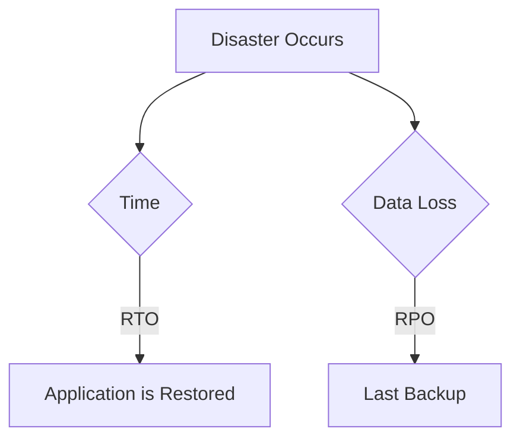

# Principles of Backup and Disaster Recovery

Backup and disaster recovery are two essential components of a comprehensive business continuity plan. They work together to ensure that an organization can recover its data and resume its operations in the event of a disaster.

## Principles of Backup

A backup is a copy of data that is taken and stored elsewhere so that it can be used to restore the original after a data loss event. The following are the key principles of backup:

*   **Regularity:** Backups should be performed on a regular basis to minimize the amount of data that is lost in the event of a failure.
*   **3-2-1 Rule:** This rule states that you should have three copies of your data, on two different types of media, with one copy stored off-site.
*   **Verification:** Backups should be regularly verified to ensure that they are readable and that the data can be restored.
*   **Security:** Backups should be stored securely to protect them from unauthorized access.

## Principles of Disaster Recovery

Disaster recovery is the process of restoring an organization's data and applications after a disaster. The following are the key principles of disaster recovery:

*   **Planning:** A disaster recovery plan should be developed and documented before a disaster occurs.
*   **Testing:** The disaster recovery plan should be regularly tested to ensure that it is effective.
*   **Automation:** The disaster recovery process should be automated as much as possible to minimize the time it takes to recover.
*   **Communication:** A communication plan should be in place to keep employees and customers informed during a disaster.

## RTO and RPO

Recovery Time Objective (RTO) and Recovery Point Objective (RPO) are two of the most important metrics in disaster recovery.

### Recovery Time Objective (RTO)

RTO is the maximum amount of time that an application can be down after a disaster. For example, if an application has an RTO of one hour, it means that the application must be back up and running within one hour of the disaster.

### Recovery Point Objective (RPO)

RPO is the maximum amount of data that can be lost from an application after a disaster. For example, if an application has an RPO of 15 minutes, it means that the application can lose no more than 15 minutes of data.

## The Significance of RTO and RPO

RTO and RPO are significant because they help to define the requirements for a disaster recovery solution. The lower the RTO and RPO, the more expensive and complex the disaster recovery solution will be.

For example, an application with an RTO of zero and an RPO of zero would require a fully redundant, geographically dispersed infrastructure with real-time data replication. This would be a very expensive solution, but it would provide the highest level of protection.

On the other hand, an application with an RTO of 24 hours and an RPO of 24 hours could be protected with a simple tape backup solution. This would be a much less expensive solution, but it would provide a lower level of protection.

## Diagram: RTO and RPO

