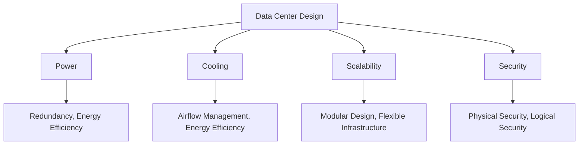

# Data Center: Concepts, Requirements, and Design Influences

## What is a Data Center?

A data center is a dedicated facility that an organization uses to house its most critical applications and data. It is a centralized location that contains the computing and networking equipment necessary to collect, store, process, and distribute large amounts of data.

## Key Requirements for Data Center Elements

Modern data centers are complex facilities with a wide range of components. The key requirements for these elements can be broken down into the following categories:

*   **Core Components:** Servers, storage systems, and networking equipment.
*   **Facility Infrastructure:** Power, cooling, and physical security.
*   **Operational Requirements:** Scalability, high availability, and monitoring.

## Influence of Key Factors on Data Center Design

The design of a data center is heavily influenced by four key factors: power, cooling, scalability, and security.

### 1. Power

*   **Influence on Design:** The design of the power infrastructure is critical to the reliability of the data center. It must be designed to provide clean, consistent power to all of the equipment in the data center, even in the event of a power outage.
*   **Design Considerations:**
    *   **Redundancy:** The power infrastructure should be designed with redundant components, such as uninterruptible power supplies (UPS) and backup generators, to ensure that there is no single point of failure.
    *   **Power Distribution:** The power distribution system should be designed to deliver the right amount of power to each rack of equipment.
    *   **Energy Efficiency:** The power infrastructure should be designed to be as energy-efficient as possible to reduce operating costs.

### 2. Cooling

*   **Influence on Design:** The cooling system is responsible for removing the heat that is generated by the IT equipment in the data center. If the cooling system is not designed properly, the equipment can overheat and fail.
*   **Design Considerations:**
    *   **Airflow Management:** The cooling system should be designed to ensure that there is proper airflow throughout the data center. This can be achieved through the use of hot and cold aisles, as well as other techniques.
    *   **Cooling Capacity:** The cooling system must have enough capacity to remove all of the heat that is generated by the IT equipment.
    *   **Energy Efficiency:** The cooling system should be designed to be as energy-efficient as possible to reduce operating costs.

### 3. Scalability

*   **Influence on Design:** The data center should be designed to be scalable, so that it can grow to meet the future needs of the business.
*   **Design Considerations:**
    *   **Modular Design:** A modular design allows you to add more racks, servers, and storage as needed.
    *   **Flexible Infrastructure:** The power and cooling infrastructure should be designed to be flexible, so that it can be easily expanded to support future growth.

### 4. Security

*   **Influence on Design:** The data center must be designed to be secure, both physically and logically.
*   **Design Considerations:**
    *   **Physical Security:** The data center should be protected by multiple layers of physical security, such as fences, gates, security guards, and biometric access control.
    *   **Logical Security:** The data center should be protected by multiple layers of logical security, such as firewalls, intrusion detection systems, and access control lists.

## Diagram: Data Center Design Influences

