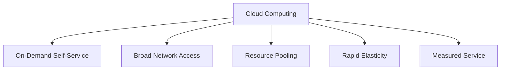

# Cloud Computing and Cloud Storage

## What is Cloud Computing?

Cloud computing is the delivery of computing services—including servers, storage, databases, networking, software, analytics, and intelligence—over the Internet ("the cloud") to offer faster innovation, flexible resources, and economies of scale.

## Key Characteristics of Cloud Computing

The National Institute of Standards and Technology (NIST) defines five essential characteristics of cloud computing:

1.  **On-Demand Self-Service:** A consumer can unilaterally provision computing capabilities, such as server time and network storage, as needed automatically without requiring human interaction with each service provider.

2.  **Broad Network Access:** Capabilities are available over the network and accessed through standard mechanisms that promote use by heterogeneous thin or thick client platforms (e.g., mobile phones, tablets, laptops, and workstations).

3.  **Resource Pooling:** The provider's computing resources are pooled to serve multiple consumers using a multi-tenant model, with different physical and virtual resources dynamically assigned and reassigned according to consumer demand.

4.  **Rapid Elasticity:** Capabilities can be elastically provisioned and released, in some cases automatically, to scale rapidly outward and inward commensurate with demand. To the consumer, the capabilities available for provisioning often appear to be unlimited and can be appropriated in any quantity at any time.

5.  **Measured Service:** Cloud systems automatically control and optimize resource use by leveraging a metering capability at some level of abstraction appropriate to the type of service (e.g., storage, processing, bandwidth, and active user accounts). Resource usage can be monitored, controlled, and reported, providing transparency for both the provider and consumer of the utilized service.

## Benefits of Cloud Storage Over Traditional Storage

Cloud storage offers several advantages over traditional on-premises storage methods:

*   **Cost Savings:** Cloud storage eliminates the need to purchase and maintain expensive storage hardware. You pay only for the storage you use, which can result in significant cost savings.

*   **Accessibility:** Data stored in the cloud can be accessed from anywhere with an internet connection, on any device.

*   **Scalability:** Cloud storage is highly scalable. You can easily increase or decrease your storage capacity as your needs change.

*   **Data Protection:** Cloud storage providers typically replicate your data across multiple data centers, which provides a high level of data protection and disaster recovery.

*   **Security:** Cloud storage providers offer a variety of security features to protect your data, such as encryption, access control, and identity and access management.

*   **Collaboration:** Cloud storage makes it easy to share files and collaborate with others.

## Diagram: Cloud Computing Characteristics

