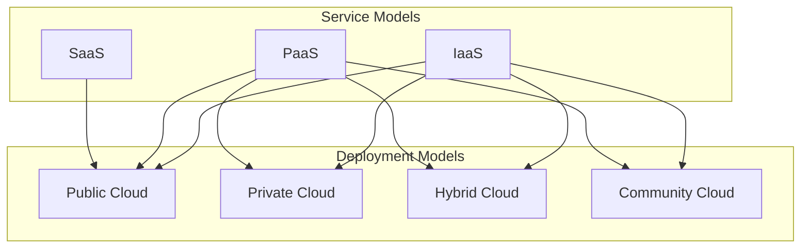

# Cloud Service Models and Deployment Models

Cloud computing is a broad term that encompasses a variety of services and deployment models. Understanding these models is essential to understanding how cloud computing works.

## Cloud Service Models

There are three main cloud service models: Infrastructure as a Service (IaaS), Platform as a Service (PaaS), and Software as a Service (SaaS).

### 1. Infrastructure as a Service (IaaS)

IaaS provides the fundamental building blocks of a cloud computing environment, including servers, storage, and networking. It gives you the most control over your IT resources, but it also requires the most management.

*   **Analogy:** IaaS is like leasing a plot of land. You are responsible for building the house, but you have complete control over the design and construction.
*   **Examples:** Amazon Web Services (AWS), Microsoft Azure, Google Compute Engine.

### 2. Platform as a Service (PaaS)

PaaS provides a platform for developing, running, and managing applications without the complexity of building and maintaining the underlying infrastructure.

*   **Analogy:** PaaS is like renting a house. The house is already built, but you can still furnish it and decorate it to your liking.
*   **Examples:** AWS Elastic Beanstalk, Heroku, Google App Engine.

### 3. Software as a Service (SaaS)

SaaS provides a complete software application that is delivered over the Internet. You do not have to worry about managing the underlying infrastructure or the application itself.

*   **Analogy:** SaaS is like staying in a hotel. Everything is taken care of for you, from the room to the food to the cleaning.
*   **Examples:** Salesforce, Gmail, Microsoft Office 365.

## Cloud Deployment Models

There are four main cloud deployment models: public, private, hybrid, and community.

### 1. Public Cloud

A public cloud is a cloud computing environment that is owned and operated by a third-party provider and is open to the public.

*   **Example:** AWS, Microsoft Azure, and Google Cloud are all examples of public clouds.

### 2. Private Cloud

A private cloud is a cloud computing environment that is dedicated to a single organization. It can be hosted on-premises or by a third-party provider.

*   **Example:** A company might build a private cloud to host its sensitive data and applications.

### 3. Hybrid Cloud

A hybrid cloud is a combination of a public cloud and a private cloud. It allows you to take advantage of the benefits of both models.

*   **Example:** A company might use a private cloud to host its sensitive data and a public cloud to host its less sensitive data and applications.

### 4. Community Cloud

A community cloud is a cloud computing environment that is shared by a group of organizations with common interests, such as a group of universities or government agencies.

*   **Example:** A group of universities might create a community cloud to share research data and applications.

## Diagram: Cloud Models

