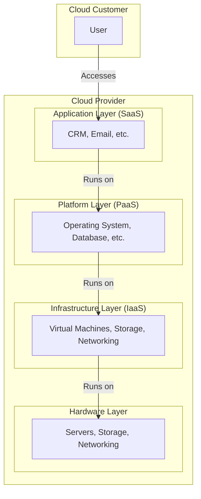

# The Architectural Framework of Cloud Computing

The architectural framework of cloud computing is a layered structure that defines how cloud services are delivered to customers. It is composed of several layers, each of which provides a different level of abstraction.

## The Cloud Computing Layers

The cloud computing architecture can be broadly divided into four layers: the hardware layer, the infrastructure layer, the platform layer, and the application layer.

### 1. Hardware Layer (The Foundation)

The hardware layer is the foundation of the cloud computing architecture. It consists of the physical hardware that is used to build the cloud, such as servers, storage devices, and networking equipment.

*   **Role:** To provide the physical resources that are needed to run the cloud.

### 2. Infrastructure Layer (IaaS)

The infrastructure layer, also known as the Infrastructure as a Service (IaaS) layer, is the layer that provides the virtualized computing resources, such as virtual machines, storage, and networking.

*   **Role:** To provide the basic building blocks of the cloud, which can be used to build and run applications.

### 3. Platform Layer (PaaS)

The platform layer, also known as the Platform as a Service (PaaS) layer, is the layer that provides a platform for developing, running, and managing applications. It typically includes an operating system, a programming language execution environment, a database, and a web server.

*   **Role:** To provide a complete development and deployment environment for applications, without the complexity of building and maintaining the underlying infrastructure.

### 4. Application Layer (SaaS)

The application layer, also known as the Software as a Service (SaaS) layer, is the layer that provides the actual software applications that are delivered to customers over the Internet.

*   **Role:** To provide ready-to-use software applications that can be accessed from any device with an Internet connection.

## How the Layers Work Together

The different layers of the cloud computing architecture work together to provide a complete solution for delivering cloud services.

*   The **hardware layer** provides the physical resources.
*   The **infrastructure layer** virtualizes the physical resources and makes them available as a service.
*   The **platform layer** provides a platform for developing and running applications on the virtualized infrastructure.
*   The **application layer** provides the actual software applications that are delivered to customers.

## Diagram: Cloud Computing Architecture Layers

