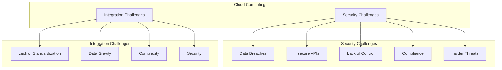

# Major Cloud Security and Integration Challenges

Cloud computing offers many benefits, but it also presents a number of security and integration challenges that organizations must address.

## Cloud Security Challenges

### 1. Data Breaches

Data breaches are one of the most significant security risks in the cloud. If a cloud provider's security is compromised, it can expose the data of all of its customers.

### 2. Insecure APIs

Cloud services are accessed through APIs (Application Programming Interfaces). If these APIs are not secure, they can be exploited by attackers to gain unauthorized access to data and resources.

### 3. Lack of Visibility and Control

When you move your data and applications to the cloud, you give up some control over them. This can make it difficult to monitor your environment and to ensure that your security policies are being enforced.

### 4. Compliance

Organizations in regulated industries, such as healthcare and finance, must comply with a variety of security regulations. It can be challenging to ensure that your cloud environment meets all of the requirements of these regulations.

### 5. Insider Threats

Insider threats are a risk in any environment, but they can be particularly challenging to detect and prevent in the cloud. A malicious insider with access to your cloud environment can cause a great deal of damage.

## Cloud Integration Challenges

### 1. Lack of Standardization

There is a lack of standardization among cloud providers, which can make it difficult to integrate services from different providers.

### 2. Data Gravity

Data gravity is the tendency of data to attract applications and services. As you move more data to the cloud, it can become increasingly difficult to move it to another provider or to bring it back on-premises.

### 3. Complexity

Integrating on-premises applications with cloud services can be complex. It requires careful planning and execution to ensure that the integration is seamless and secure.

### 4. Security

Integrating on-premises and cloud environments can create new security risks. It is important to carefully consider the security implications of any integration and to implement appropriate security controls.

## Mitigating the Challenges

Organizations can take a number of steps to mitigate the security and integration challenges of cloud computing, including:

*   **Choose a reputable cloud provider:** Select a provider with a strong security track record and a commitment to compliance.
*   **Implement strong security controls:** Use strong passwords, multi-factor authentication, and encryption to protect your data.
*   **Monitor your environment:** Use a cloud security posture management (CSPM) tool to monitor your environment for security risks.
*   **Develop a cloud integration strategy:** Carefully plan your cloud integration to ensure that it is seamless and secure.

## Diagram: Cloud Challenges

