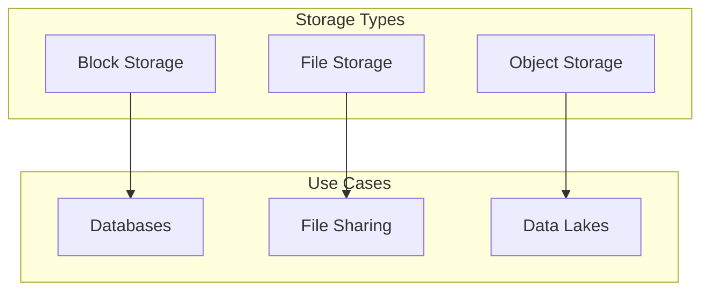

# Block vs. File vs. Object Storage in the Cloud

In cloud computing, there are three main types of storage: block storage, file storage, and object storage. Each type has its own advantages and disadvantages, and the best choice for a particular application depends on the specific requirements of that application.

## Block Storage

Block storage is the simplest type of storage. It provides raw storage volumes that can be attached to virtual machines. The operating system on the virtual machine can then format the block storage with a file system and use it as if it were a local disk drive.

*   **How it works:** Data is stored in fixed-size blocks, and each block has a unique address.
*   **Use cases:** Block storage is ideal for applications that require high performance and low latency, such as databases and transactional applications.
*   **Examples:** Amazon Elastic Block Store (EBS), Google Persistent Disk.

## File Storage

File storage, also known as network-attached storage (NAS), is a type of storage that provides a shared file system that can be accessed by multiple virtual machines.

*   **How it works:** Data is stored in a hierarchical structure of files and folders.
*   **Use cases:** File storage is ideal for applications that require shared access to files, such as file servers, content management systems, and development environments.
*   **Examples:** Amazon Elastic File System (EFS), Google Cloud Filestore.

## Object Storage

Object storage is a type of storage that is designed for storing large amounts of unstructured data, such as images, videos, and backups.

*   **How it works:** Data is stored as objects, and each object has a unique identifier. Objects are stored in a flat address space, which makes it easy to scale to very large amounts of data.
*   **Use cases:** Object storage is ideal for applications that need to store and retrieve large amounts of data, such as data lakes, backup and recovery, and media streaming.
*   **Examples:** Amazon S3, Google Cloud Storage.

## Comparison Table

| Feature | Block Storage | File Storage | Object Storage |
|---|---|---|---|
| **Access Method** | Block-level | File-level | Object-level (API) |
| **Data Structure** | Blocks | Hierarchical (files and folders) | Flat (objects) |
| **Performance** | High | Medium | Variable |
| **Scalability** | Good | Good | Excellent |
| **Cost** | High | Medium | Low |
| **Use Cases** | Databases, transactional applications | File sharing, content management | Data lakes, backup and recovery |

## Diagram: Storage Types

